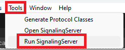
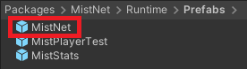
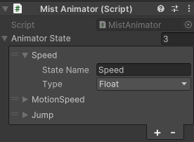
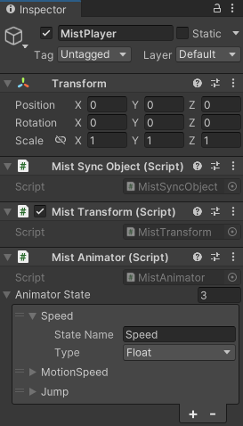
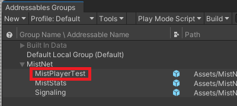

# MistNet
A fully decentralized network library.

# Features
- Connects via a partial mesh P2P architecture.
- There is no central server.
- Communication utilizes WebRTC.

# Installation
UPM Package
This software requires MemoryPack and UniTask to be imported beforehand.
- MemoryPack
```
https://github.com/Cysharp/MemoryPack.git?path=src/MemoryPack.Unity/Assets/Plugins/MemoryPack
```
- UniTask
```
https://github.com/Cysharp/UniTask.git?path=src/UniTask/Assets/Plugins/UniTask
```
- MistNet
```
git@github.com:DecentralizedMetaverse/mistnet.git?path=/Assets/MistNet
```

# Signaling Server
Two types are provided, both functioning in the same manner.
## Python
- MistNet/main.py



## C#


# Initial Setup
Please place the "MistNet" Prefab on the Scene.

The Prefab can be found under "Packages/MistNet/Runtime/Prefabs".



# Connection Settings
- SignalingServerAddress
    - Where signaling is conducted
- MinConnection (currently unused)
- LimitConnection
    - The limit on the number of connections
        - The number of connections may exceed this limit, but
        connections with lower priority will be automatically disconnected to keep within the limit.
- MaxConnection
    - Maximum number of connections
```json
{
    "SignalingServerAddress": "ws://localhost:8080/ws",
    "MinConnection": 2,
    "LimitConnection": 20,
    "MaxConnection": 80
}
```

# Setting up GameObjects to Synchronize

## Configuration
- Add "MistSyncObject" as a component.
    - Used for RPC calls and identifying the object to sync.
    
## Position Synchronization Method
- Add "MistTransform" as a component.

## Animation Synchronization Method
- Add "MistAnimator" as a component.
- Configure the parameters to synchronize as shown below.



## Example of Configured Synchronization GameObject


## Instantiate
- Instead of placing the GameObjects to synchronize in the Scene from the start,
you need to instantiate them through MistNet.

- Register the GameObject Prefab to be targeted with Addressable Assets and execute as shown below.




```csharp
[SerializeField] 
private string prefabAddress = "Assets/Prefab/MistNet/MistPlayerTest.prefab";

MistManager.I.InstantiateAsync(prefabAddress, position, Quaternion.identity).Forget();
```

# RPC
## Registration Method
Prepend `[MistRpc]` to the method.
```csharp
[MistRpc]
private void RPC_○○ () {}
```

## Invocation Method
```csharp
[SerializeField] private MistSyncObject syncObject;

// Method to send to all connected Peers
syncObject.RPCAll(nameof(RPC_○○), args);

// Method to execute by specifying the recipient's ID
syncObject.RPC(id, nameof(RPC_○○), args);
```